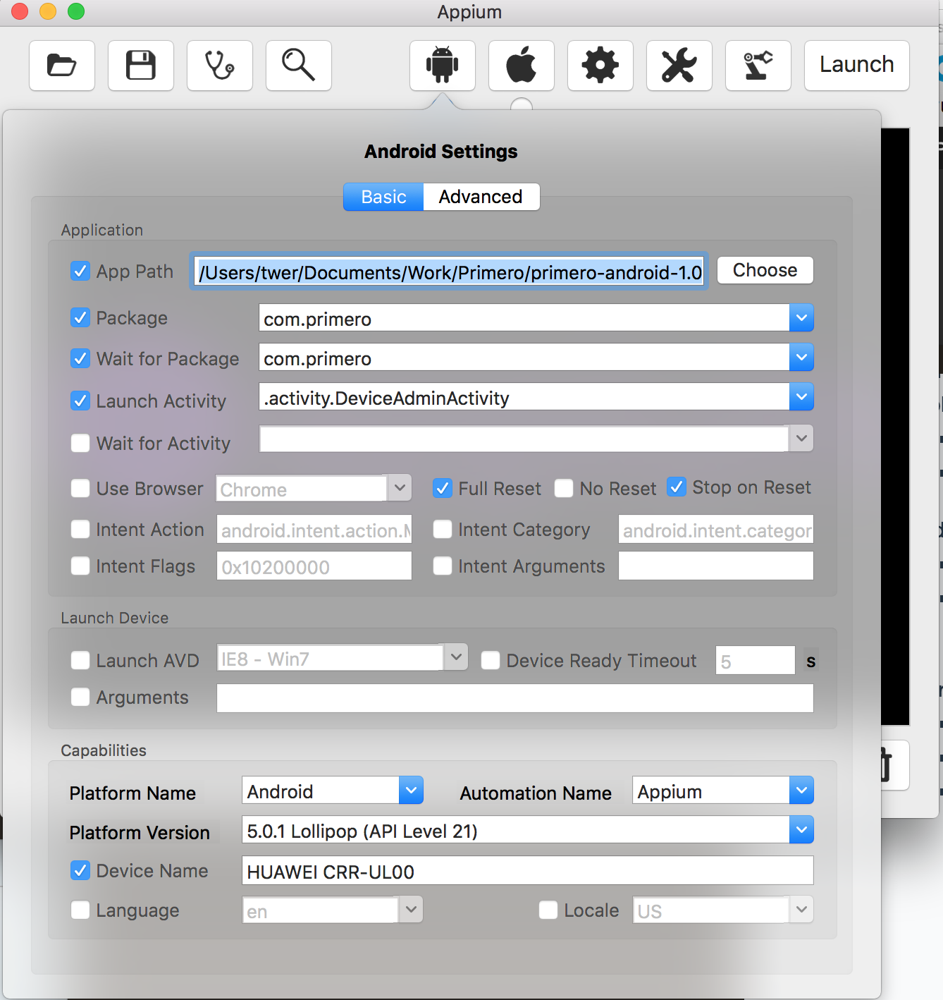
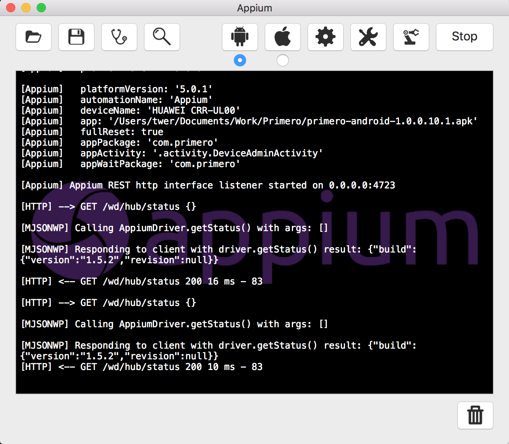
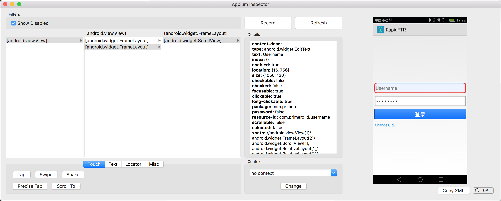

介绍Appium的原理和启动

[Appium.io](http://appium.io/)
[Appium for Android（JS）](https://nishantverma.gitbooks.io/appium-for-android/content/index.html)
[ruby_lib/docs](https://github.com/appium/ruby_lib/blob/master/docs/docs.md)

**Appium**是一个移动端的自动化框架，可用于测试原生应用，移动网页应用和混合型应用，且是跨平台的。可用于IOS，Android和firefox操作系统。原生的应用是指用Android或IOS的SDK编写的应用。 移动网页应用是指网页应用，类似IOS中的Safari应用、Chrome应用或者类浏览器的应用。混合应用是指一种包裹WebView的应用，原生应用于网页内容交互性的应用。
 
 - **Appium特点**
    - 使用自动化来测试一个App，但是不需要重新编译App
    - 支持多种语言（Ruby/Java/Python...）和测试框架（Cucumber...）
    - 使用WebDriver协议里的api
    - 开源
- **Appium的设计**
    - 采用底层驱动商提供的自动化框架
        - IOS: 苹果的UIAutomation
        - Android 4.2+: 谷歌的UiAutomatior
        - Android 2.3+: 谷歌的Instrumentation （已被selendroid取代）
    - 采用底层驱动商提供统一API，就是WebDriver API
        - WebDriver（也称Selenium WebDriver）其实是一个C/S（Client/Server）架构的协议，叫做JSON Wire Protocol。通过这个协议，用任何语言写成的客户端都可以发送HTTP请求给服务器。这就意味着你可以自由选择你想要使用的测试框架和执行器，也可以将任何包含HTTP客户端的库文件加入你的代码中。换句话说，Appium的WebDriver不是一个技术上的测试框架，而是一个自动化库。
    - 在WebDriver的基础上，扩展了一些适合移动端自动化协议的API
- **Appium的概念**
    - C/S Architecture
        - Appium的核心是一个暴露了一系列REST API的server。
        - server的功能：监听一个端口，然后接收由client发送来的command；翻译这些command，将其转换成移动设备可以理解的形式发送给移动设备；移动设备执行command后将执行结果返回给appium server；appium server再把执行结果返回给client。
        - client就是发起command的设备，一般来说就是执行appium测试代码的机器。狭义点，可以把client理解成是代码，它实现了WebDriver标准协议。
    - Session
        - Appium自动化要在session start后才可以进行。client初始化一个session会话，发送POST/session请求到server，这些请求里面都会带有一个对象：desired capability。server启动自动化session，然后返回一个session id，以后所有的请求都必须带上这个session id。
        - 由于session id是全局唯一的，那么在同一台机器上启动多个session就变成了可能，这就是selenium grid所依赖的理论依据。
    - Desired Capabilities
        - desired capability 这个对象其实是一个key-value的集合，里面包含了各种各样的信息，发送到server后，server解析这些信息就知道了client对哪种session感兴趣，然后启动相应的session。desired capability里面的信息会影响着server启动session的类型。
    - Appium server
        - 在命令行用appium打开的东西。
    - Appium client
        - 原生的WebDriver api是为web端设计的，appium官方提供了一套appium client。在测试的时候，一般要用这个库替代原生的WebDriver库。
        - [Appium Client Libraries](http://appium.io/downloads.html)
        - [WebDriver实用指南（Ruby/Java/Python版本）](https://github.com/lemon123456/webdriver_guide)
        
-----------------
###启动Appium
- **Using app**
	- [Download the Appium app](https://github.com/appium/appium/releases)
	- Run it
- **Requirements**
	- Tool to verify appium installation
		- `npm install -g appium-doctor`
		- `appium-doctor`
	- Android Debug bridge
		- Connect one Android device.
		- `adb devices`  you should see one device connected.	
- **Start Appium**
	- Android Settings
	     
	- Launch
	     
	- Inspecto
	     

------------------------
###Appium-Ruby
``` ruby
require 'appium_lib'

caps = {
	caps: {
		platformName: 'Android',
		appActivity: '.Calculator',
		appPackage: 'com.android.calculator'
	},
	appium_lib: {
		sauce_username: nil,
		sauce_access_key: nil
	}
}
driver = Appium::Driver.new(caps).start_driver
```
- [Desired Capabilities for Android](https://nishantverma.gitbooks.io/appium-for-android/content/desired_capabilities_for_android.html)
- Desired Capabilities的通用配置
	- automationName：使用哪种自动化引擎。appium（默认）或者Selendroid	
	- plateformName：使用哪种移动平台。IOS, Android, FirefoxOS
	- deviceName：启动哪种设备，真机或者模拟器？iPhone Simulator, iPad Simulator, Android Emulator, Galaxy 4s, etc...
	- app：应用的绝对路径 or 指向远程的 .ipa/.apk 文件的http URL.  如果指定了appPackage和appActivity的话，可以不用指定app。app属性和browserName属性冲突。
	- browserName：移动浏览器名称。
	- udid：物理机的id。
	- onReset：在启动session前不重置应用的状态。Default false.
	- fullReset：通过卸载应用的方式重置应用的状态。Default false.

- Android平台特定的属性
	- appActivity：待测试app的Activity名字。如 MainActivity, .Settings。注意，原生app的话要在activity前面加个“ . ”。
	- appPackage：待测试app的 java package。


